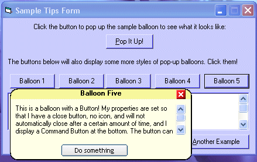



## Popup Balloon Help: another enhancement

### Description

This project is an enhancement of another submission . This project displays advanced Win2K/XP style "balloons" and is based on CodeJack's enhancement Project(http://www.planetsourcecode.com/vb/scripts/ShowCode.asp?txtCodeId=31523&lngWId=1). This version includes a command button within the balloon, using the LaVolpeButton control - which is included in the zip. When the button is to be displayed the textbox height changes so as not to over-run the button.

The LaVolpeButton V3 project can be found here: (http://www.planetsourcecode.com/vb/scripts/ShowCode.asp?txtCodeId=31479&lngWId=1)

See the readme in the project for details from original author and notes about enhancements.

----

Clip from original submission 

----

This code will show Windows 2000/XP-style popup balloons. They were introduced in Windows 2000, and in XP they're seen all over, especially in the system tray. But Microsoft hasn't released how to use them yet (except for tray icons),and--if they did--it would only work on Windows 2000 or later. This project shows you how you can use these balloons in your programs. Instead of relying on Windows to make them, this program makes its own. Therefore, it will not only work with Windows 2000 and XP, but also with all other versions of Windows (down to 95). ..... Original submission can be found here: http://www.planet-source-code.com/vb/scripts/ShowCode.asp?txtCodeId=31434&lngWId=1
 
### More Info
 

             |
---                |---
**Submitted On**   |2002-02-08 11:28:18
**By**             |[M@rkS](https://github.com/Planet-Source-Code/PSCIndex/blob/master/ByAuthor/m-rks.md)
**Level**          |Intermediate
**User Rating**    |5.0 (20 globes from 4 users)
**Compatibility**  |VB 6\.0
**Category**       |[Miscellaneous](https://github.com/Planet-Source-Code/PSCIndex/blob/master/ByCategory/miscellaneous__1-1.md)
**World**          |[Visual Basic](https://github.com/Planet-Source-Code/PSCIndex/blob/master/ByWorld/visual-basic.md)
**Archive File**   |[Popup\_Ball53819272002\.zip](https://github.com/Planet-Source-Code/m-rks-popup-balloon-help-another-enhancement__1-31592/archive/master.zip)

### API Declarations

Yip

